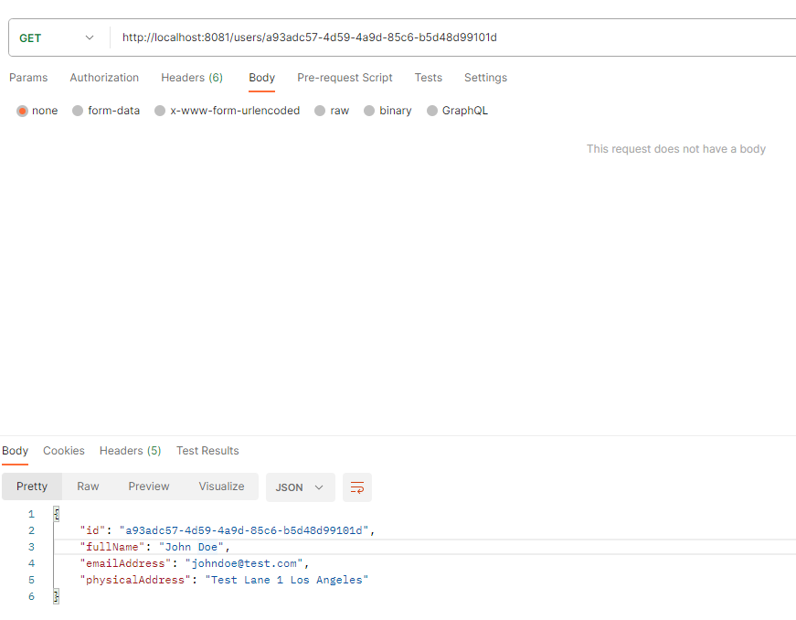
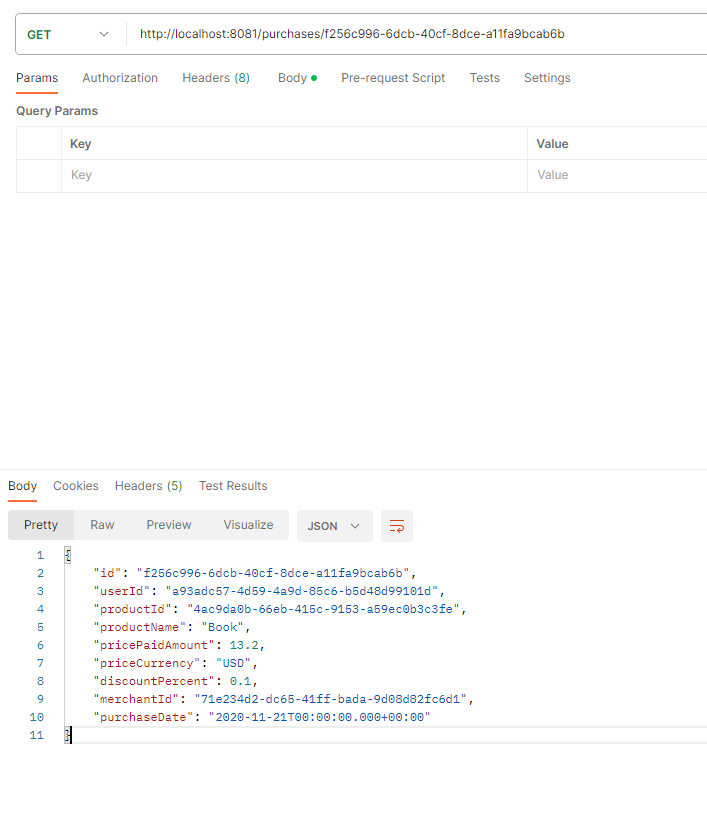
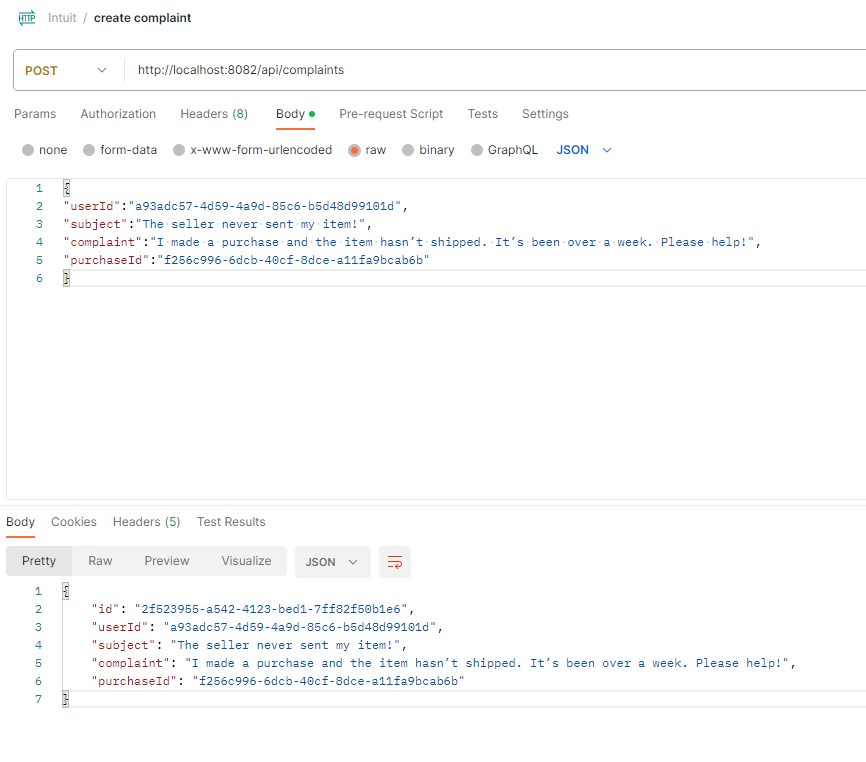
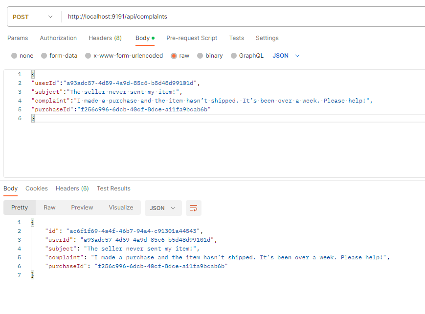
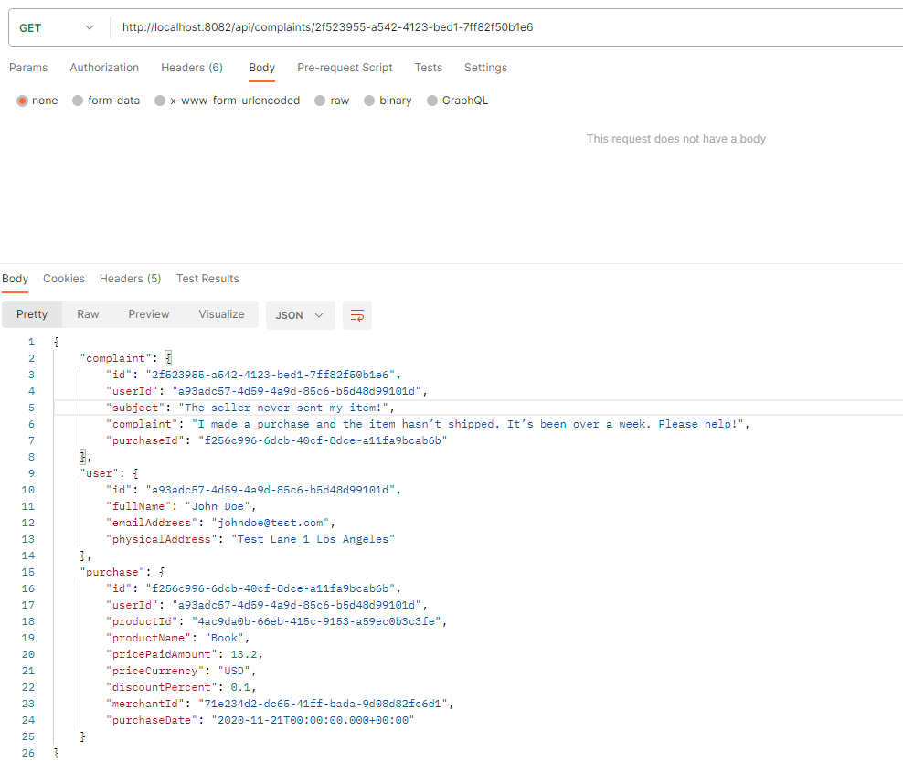
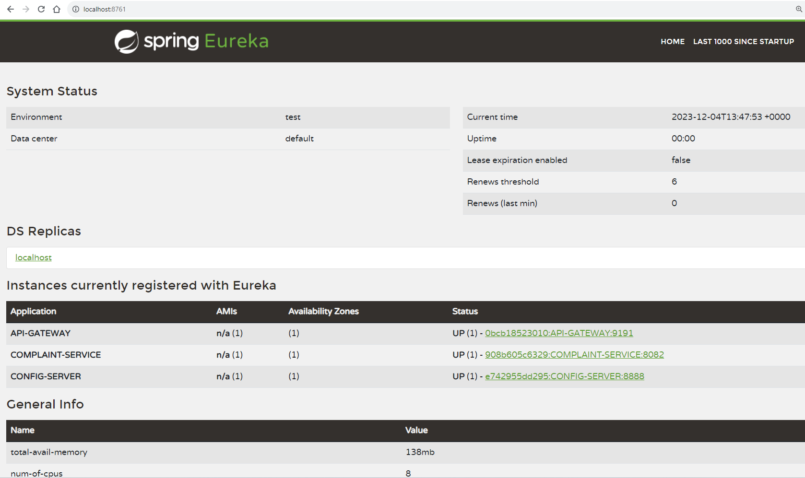

## Customer Complaints Management System

### Use with Docker Development Environments

You can open this project in the Dev Environments feature of Docker Desktop version 4.12 or later.

[Open in Docker Dev Environments ](https://open.docker.com/dashboard/dev-envs?url=https://github.com/tayeh10/customer-complaints-microservices)

### Spring backend and H2 in memory database

Project structure:
```
.
├── api-gateway
│   ├── Dockerfile
│   ...
├── complaint-service
│   └── Dockerfile
│   ...
├── complaints-system-craft-mock
│   └── Dockerfile
│   ...
├── config-server
│   └── Dockerfile
│   ...
├── docker-compose.yaml
├── README.md
├── service-registry
│   └── Dockerfile
│   ...
└──
```

[_docker_compose.yaml_](docker_compose.yaml)
```
version: '3.8'

services:
  service-registry:
    build:
      context: ./service-registry
    ports:
      - "8761:8761"
  config-server:
    build:
      context: ./config-server
    ports:
      - "8888:8888"
    links:
      - service-registry
    depends_on:
      - service-registry
    environment:
      eureka.client.serviceUrl.defaultZone: http://service-registry:8761/eureka
  api-gateway:
    build:
      context: ./api-gateway
    ports:
      - "9191:9191"
    links:
      - service-registry
    depends_on:
      - service-registry
    environment:
      eureka.client.serviceUrl.defaultZone: http://service-registry:8761/eureka

  complaints-system-craft-mock:
    build:
      context: ./complaints-system-craft-mock
    ports:
      - "8081:8081"

  complaint-service:
    build:
      context: ./complaint-service
    environment:
      user.service.url: http://host.docker.internal:8081/users/
      purchase.service.url: http://host.docker.internal:8081/purchases/
      eureka.client.serviceUrl.defaultZone: http://service-registry:8761/eureka
    ports:
      - "8082:8082"
    links:
      - service-registry
      - config-server
      - complaints-system-craft-mock
    depends_on:
      - service-registry
      - config-server
      - complaints-system-craft-mock

```
The compose file defines an application with five services: `service-registry`, `config-server`, `api-gateway`, `complaints-system-craft-mock` and `complaint-service`.
When deploying the application:

docker compose maps ports:

`8761` of the `service-registry` service container to port `8761` of the host as specified in the file.

`8888` of the `config-server` container to port `8888` of the host as specified in the file.

`9191` of the `api-gateway` container to port `9191` of the host as specified in the file.

`8081` of the `complaints-system-craft-mock` container to port `8081` of the host as specified in the file.

`8082` of the `complaint-service` container to port `8082` of the host as specified in the file.

Please make sure that ports: `8761, 8888, 9191, 8081 and 8082` on the host are not already being in use.

> ℹ️ **_NOTE_**
> 
> The project use in memory db H2 which being defined on complaint-service service. So each run of the service need to test the flows with new API's run and new data.
> 
> The project contains one eureka server service and 3 eureka client services.
> 
> `service-registry` - is the eureka server service.
> 
> `config-server` - is the eureka client service which bring the application properties from github repo.
> 
> `api-gateway` - is the eureka client service which scale the application to map the call to the up services in case running multi instances of `complaint-service` service.
> 
> `complaints-system-craft-mock` - is the mock service which attached to the task.
> 
> `complaint-service` - is the eureka client service handle complaints services and expose the two API's: create complaint and get complaint by id.
> 

## Deploy with docker compose

> ℹ️ **_NOTE_**
> Before deploy with docker compose need to run mvn clean install for all the services except the mock service `complaints-system-craft-mock` so the jars:
> 
> `service-registry-0.0.1-SNAPSHOT.jar`
> 
> `config-server-0.0.1-SNAPSHOT.jar`
> 
> `api-gateway-0.0.1-SNAPSHOT.jar`
> 
> `complaint-service-0.0.1-SNAPSHOT.jar`
> 
> will be created under target directories in each module.

```
Go to the directory where is the file docker_compose.yaml and run the command
$ docker-compose up --build -d
[+] Building 0.6s (13/13)
[+] Building 2.3s (28/28) FINISHED
 => [service-registry internal] load .dockerignore                                                                                                                                                          0.0s
 => => transferring context: 2B                                                                                                                                                                             0.0s
 => [service-registry internal] load build definition from Dockerfile                                                                                                                                       0.1s
 => => transferring dockerfile: 210B                                                                                                                                                                        0.0s
 => [complaints-system-craft-mock internal] load build definition from Dockerfile                                                                                                                           0.1s
 => => transferring dockerfile: 224B                                                                                                                                                                        0.0s
 => [complaints-system-craft-mock internal] load .dockerignore                                                                                                                                              0.1s
 => => transferring context: 2B                                                                                                                                                                             0.0s
 => [complaint-service internal] load metadata for docker.io/library/eclipse-temurin:17                                                                                                                     0.0s
 => [complaint-service 1/3] FROM docker.io/library/eclipse-temurin:17                                                                                                                                       0.0s
 => [service-registry internal] load build context                                                                                                                                                          0.1s
 => => transferring context: 92B                                                                                                                                                                            0.0s
 => [complaints-system-craft-mock internal] load build context                                                                                                                                              0.1s
 => => transferring context: 56B                                                                                                                                                                            0.0s
 => CACHED [complaint-service 2/3] WORKDIR /app                                                                                                                                                             0.0s
 => CACHED [service-registry 3/3] COPY target/service-registry-0.0.1-SNAPSHOT.jar /app/service-registry.jar                                                                                                 0.0s
 => [service-registry] exporting to image                                                                                                                                                                   0.0s
 => => exporting layers
...
time="2023-12-04T12:19:00+02:00" level=warning msg="Found orphan containers ([customer-complaints-microservices-complaint-system-craft-mock-1]) for this project. If you removed or renamed this service in your compose file, you can run this command with the --remove-orphans flag to clean it up."
[+] Running 5/5
 ✔ Container customer-complaints-microservices-complaints-system-craft-mock-1  Started                                                                                                                      1.9s
 ✔ Container customer-complaints-microservices-service-registry-1              Started                                                                                                                      1.8s
 ✔ Container customer-complaints-microservices-api-gateway-1                   Started                                                                                                                      3.7s
 ✔ Container customer-complaints-microservices-config-server-1                 Started                                                                                                                      4.2s
 ✔ Container customer-complaints-microservices-complaint-service-1             Started

```

## Expected result

Listing containers must show three containers running and the port mapping as below:
```
PS C:\Spring Boot Course Projects\intuit\customer-complaints-microservices> docker ps
CONTAINER ID   IMAGE                                                            COMMAND                  CREATED             STATUS         PORTS                    NAMES
e0d0536dbdf5   customer-complaints-microservices-complaint-service              "java -jar complaint…"   38 minutes ago      Up 3 minutes   0.0.0.0:8082->8082/tcp   customer-complaints-microservices-complaint-service-1
4b5488acd444   customer-complaints-microservices-api-gateway                    "java -jar api-gatew…"   38 minutes ago      Up 3 minutes   0.0.0.0:9191->9191/tcp   customer-complaints-microservices-api-gateway-1
2bb7d1ae2b52   customer-complaints-microservices-config-server                  "java -jar config-se…"   38 minutes ago      Up 3 minutes   0.0.0.0:8888->8888/tcp   customer-complaints-microservices-config-server-1
ef963111cc37   customer-complaints-microservices-service-registry               "java -jar service-r…"   38 minutes ago      Up 3 minutes   0.0.0.0:8761->8761/tcp   customer-complaints-microservices-service-registry-1
0ef53249d060   customer-complaints-microservices-complaints-system-craft-mock   "java -jar complaint…"   About an hour ago   Up 3 minutes   0.0.0.0:8081->8081/tcp   customer-complaints-microservices-complaints-system-craft-mock-1
```

After the application starts, need to test first that mock service is working fine.
You can use Postman running mock rest API's.

> ℹ️ **_NOTE_**
> The user id's and purchses id's data which the mock returned located at the task pdf.
> I will give run examples for mock values located from the task PDF.

The mock expose two API's:
1. Get User By Id:
    http://localhost:8081/users/a93adc57-4d59-4a9d-85c6-b5d48d99101d
    You should get below result:
    

2. Get Purchase By Id:
   http://localhost:8081/purchases/f256c996-6dcb-40cf-8dce-a11fa9bcab6b
   You should get below result:
   

The second service which I developed using Spring Boot "complaint-service" expose two API's:

1. Create complaint - POST:

    http://localhost:8082/api/complaints

    ```
    Example Input:
    {
    "userId":"a93adc57-4d59-4a9d-85c6-b5d48d99101d",
    "subject":"The seller never sent my item!",
    "complaint":"I made a purchase and the item hasn’t shipped. It’s been over a week. Please help!",
    "purchaseId":"f256c996-6dcb-40cf-8dce-a11fa9bcab6b"
    }
    ```

    ```
    Example Output:
    {
    "id": "27a41053-4e5a-466e-a4a1-50d4e2e61427",
    "userId": "a93adc57-4d59-4a9d-85c6-b5d48d99101d",
    "subject": "The seller never sent my item!",
    "complaint": "I made a purchase and the item hasn’t shipped. It’s been over a week. Please help!",
    "purchaseId": "f256c996-6dcb-40cf-8dce-a11fa9bcab6b"
    }
    ```
   



> ℹ️ **_NOTE_**
>
> We can also run the service on the api-gateway port:
> 
>  http://localhost:9191/api/complaints
> 
> 
>

2. Get complaint - Get:

    http://localhost:8082/api/complaints/2f523955-a542-4123-bed1-7ff82f50b1e6

```
    Example Output:
    {
    "complaint": {
        "id": "2f523955-a542-4123-bed1-7ff82f50b1e6",
        "userId": "a93adc57-4d59-4a9d-85c6-b5d48d99101d",
        "subject": "The seller never sent my item!",
        "complaint": "I made a purchase and the item hasn’t shipped. It’s been over a week. Please help!",
        "purchaseId": "f256c996-6dcb-40cf-8dce-a11fa9bcab6b"
    },
    "user": {
        "id": "a93adc57-4d59-4a9d-85c6-b5d48d99101d",
        "fullName": "John Doe",
        "emailAddress": "johndoe@test.com",
        "physicalAddress": "Test Lane 1 Los Angeles"
    },
    "purchase": {
        "id": "f256c996-6dcb-40cf-8dce-a11fa9bcab6b",
        "userId": "a93adc57-4d59-4a9d-85c6-b5d48d99101d",
        "productId": "4ac9da0b-66eb-415c-9153-a59ec0b3c3fe",
        "productName": "Book",
        "pricePaidAmount": 13.2,
        "priceCurrency": "USD",
        "discountPercent": 0.1,
        "merchantId": "71e234d2-dc65-41ff-bada-9d08d82fc6d1",
        "purchaseDate": "2020-11-21T00:00:00.000+00:00"
    }
}
```



> ℹ️ **_NOTE_**
>
> We can also run the service on the api-gateway port:
>
>  http://localhost:9191/api/complaints/ac6f1f69-4a4f-46b7-94a4-c91301a44543
>
> 
>

You can also check the eureka server registered services by opening the link:
http://localhost:8761/



Stop and remove the containers
```
$ docker compose down
[+] Running 6/6
 ✔ Container customer-complaints-microservices-api-gateway-1                   Removed                                                                                                                                                 5.8s
 ✔ Container customer-complaints-microservices-complaint-service-1             Removed                                                                                                                                                 6.0s
 ✔ Container customer-complaints-microservices-config-server-1                 Removed                                                                                                                                                 3.7s
 ✔ Container customer-complaints-microservices-complaints-system-craft-mock-1  Removed                                                                                                                                                 0.9s
 ✔ Container customer-complaints-microservices-service-registry-1              Removed                                                                                                                                                 0.8s
 ✔ Network customer-complaints-microservices_default                           Removed
```